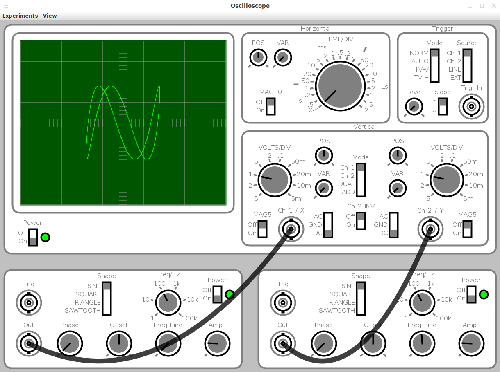

# Oscilloscope #

Simple Oscilloscope Simulator 

[Download](https://github.com/hneemann/oscilloscope/releases/latest/download/Oscilloscope.jar)

There is no installation required, simply start the jar file, which is available for 
[download](https://github.com/hneemann/oscilloscope/releases/latest/download/Oscilloscope.jar).
A [Java Runtime Environment](https://www.java.com/) (at least JRE 8) is required
to run the oscilloscope.

If there are any problems starting the oscilloscope on your system, please try to
run the jar file from a command line:

```
java -jar Oscilloscope.jar
```

# Usage

All switches and knobs of the oscilloscope and frequency generators can be 
controlled with the mouse wheel or by right/left click.

BNC cables are connected by first pressing on the output socket and then dragging 
the cable to the desired input socket. To remove a BNC cable, you can press the 
input socket and move the cable. If you release the button anywhere away from an 
input socket, the cable is removed. 
Several cables can be connected to one output socket.
 
 

The simulated frequency generators are floating voltage sources. 
The frequency generators have therefore no hidden connection to oscilloscope ground. 
